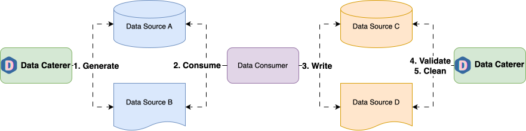

# data-caterer-example


Data Caterer is a metadata driven test data management tool that aids in creating production like data across batch and 
event data systems. Run data validations to ensure your systems have ingested it as expected. Use the Java, Scala API, 
UI, or YAML files to help with setup or customisation that are all run via Docker.

This repo contains example Java and Scala API usage for Data Caterer.



## How

Check out any of [the Scala examples](src/main/scala/io/github/datacatering/plan) or 
[Java examples](src/main/java/io/github/datacatering/plan). If you are looking for more information, you can follow 
[**detailed documentation found here**](https://data.catering/latest/docs/).

Not comfortable with Java or Scala? No worries.
[You can use the UI via these steps](https://data.catering/latest/get-started/quick-start/).
  
Want some YAML instead? Also, no worries. Check the example [plan](docker/data/custom/plan) and 
[task](docker/data/custom/task) YAML files here.

### Java

1. Create new Java class similar
   to [DocumentationJavaPlanRun.java](src/main/java/io/github/datacatering/plan/DocumentationJavaPlanRun.java)
   1. Needs to extend `io.github.datacatering.datacaterer.javaapi.api.PlanRun`

### Scala

1. Create new Scala class similar
   to [DocumentationPlanRun.scala](src/main/scala/io/github/datacatering/plan/DocumentationPlanRun.scala)
   1. Needs to extend `io.github.datacatering.datacaterer.api.PlanRun`

### YAML

1. Copy existing plan file (such as [foreign-key.yaml](docker/data/custom/plan/foreign-key.yaml)) in directory 
[docker/data/custom/plan](docker/data/custom/plan)
2. Copy existing task file (such as [json-account-task.yaml](docker/data/custom/task/file/json/json-account-task.yaml))
in directory [docker/data/custom/task](docker/data/custom/task)
   1. If you want to run data validations, copy the file [simple-validation.yaml](docker/data/custom/validation/simple-validation.yaml)
   and add validation to plan via:
   ```yaml
   validations:
     - "<name of validation (i.e. account_checks)>"
   ```
3. [Use JSON schema to help creating metadata for plan, tasks or validations](schema/data-caterer-latest.json).
You can import this schema into your IDE for validation of your YAML files. Links below show how you can import the schema:
- [IntelliJ](https://www.jetbrains.com/help/idea/json.html#ws_json_schema_add_custom)
- [VS Code](https://code.visualstudio.com/docs/languages/json#_json-schemas-and-settings)


## Run

Requires:

- Docker

```shell
./run.sh
#check results under docker/sample/report/index.html folder
```

## Docker

Create your own Docker image via:

```shell
./gradlew clean build
docker build -t <my_image_name>:<my_image_tag> .
docker run -e PLAN_CLASS=io.github.datacatering.plan.DocumentationPlanRun -v ${PWD}/docs/run:/opt/app/data <my_image_name>:<my_image_tag>
#check results under docs/run folder
```

## Docker Compose

Run with own class from either Java or Scala API:

```shell
./gradlew clean build
cd docker
PLAN_CLASS=io.github.datacatering.plan.DocumentationPlanRun DATA_SOURCE=postgres docker-compose up -d datacaterer
```

[Details from docs](https://data.catering/latest/get-started/quick-start/).  
Docker compose sample found under `docker` folder.

```shell
cd docker
docker-compose up -d datacaterer
```

Check result under [here](docker/data/custom).

Change to another data source via:

- postgres
- mysql
- cassandra
- solace
- kafka
- http

```shell
DATA_SOURCE=cassandra docker-compose up -d datacaterer
```

### Run with YAML files

Example YAML files can be found here:
- [Plan](docker/data/custom/plan): Define tasks, data sources, foreign keys, etc. to run
- [Task](docker/data/custom/task): Define data generation details such as schema and number of records
- [Validation](docker/data/custom/validation): Define data validation details to run on data sources

If you want to use a [different YAML plan](docker/data/custom/plan) for the data source, you can run:

```shell
PLAN=plan/postgres-multiple-tables DATA_SOURCE=postgres docker-compose up -d datacaterer
```

## Helm

```shell
helm install data-caterer ./data-caterer-example/helm/data-caterer
```

## Benchmarks

Base benchmark tests can be run via:

```shell
bash benchmark/run_benchmark.sh
```

Results can be found under [benchmark/results](benchmark/results).
